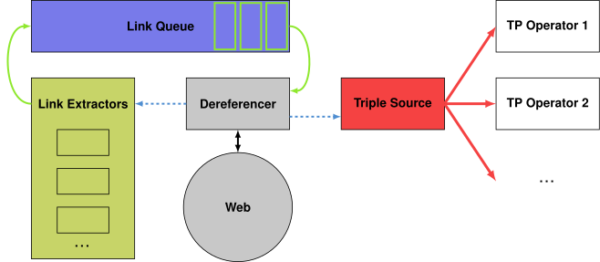

## Approach
{:#approach}

[Our previously introduced approach](cite:cites solidquery) enables query execution across one or more Solid pods
without the need to build any prior indexes.
For this, we build on top of the [Link Traversal Query Processing (LTQP)](cite cites linktraversal) paradigm,
whereby the query engine maintains an internal *link queue* which is initialized through a set of *seed URLs*.
This set of seed URLs determine the starting point for traversal, and may either be user-provided,
or can be derived from the URLs mentioned in the given SPARQL query.
The query engine will start the process by continuously iterating over this link queue, dereferencing each link,
and adding all discovered RDF triples into an internal triple source that can continuously grow.
Furthermore, for each dereferenced link with resulting RDF triples, the engine finds links to other sources,
which are appended to the link queue.
Different strategies exist for [determining these links](cite:cites linktraversalfoundations, solidquery).
During the processing of this link queue, the actual query processing happens in parallel over the continuously growing internal triple.
This processing starts by building a logical query plan using the [zero-knowledge query planning technique](cite:cites zeroknowldgequeryplanning),
which is necessary due to the fact that LTQP has no access to prior statistical information about the data to be queried over.
After that, the plan is executed following an [iterator-based pipeline approach](cite:cites linktraversalsparql),
which considers the execution plan as a [pipeline](cite:cites pipelining) of iterator-based physical operators.
This pipelined approach allows results to be returned to the end-user,
even though the link traversal and query processing may still be running for a longer time.
A visualization of the architecture of our approach can be seen in [](#figure-link-queue).

<figure id="figure-link-queue">

<figcaption markdown="block">
Link queue, dereferencer, and link extractors feeding triples into a triple source,
producing triples to tuple-producing operators
in a pipelined query execution.
</figcaption>
</figure>

Instead of considering all possible links that are discovered in the RDF triples,
we apply various [Solid-specific](cite:cites solidquery) and [Solid-agnostic](cite:cites linktraversalfoundations) link extraction strategies.
For example, all Solid pods make use of the [Linked Data Platform (LDP) specification](cite:cites spec:ldp)
to provide an overview of all RDF documents inside a pod, which may be nested in a hierarchy of *containers*.
An example of such a container can be seen in [](#example-ldpcontainer),
which contains links to another document and two containers.
In order to indicate the existence of such Solid pods,
agents within the Solid ecosystem (typically persons of organizations) may link to their pods via their identifying [*WebID*](cite:cites spec:webidprofile).
Through this WebID, agents can be uniquely identified via a URL.
After dereferencing this URL, an RDF document can be returned that can contain a link to the user's Solid pod
and other basic information such as name and contact details.
An example of such a WebID document is shown in [](#example-webidprofile).
Furthermore, Solid pods can expose a [Type Index](cite:cites spec:typeindex),
which contains a list of RDF classes for which instances exist in this pod,
together with links to RDF documents containing such instances.
An example of such a Type Index can be seen in [](#example-typeindex),
which contains entries for posts and comments.

<figure id="example-ldpcontainer" class="listing">
````/code/ldpcontainer.ttl````
<figcaption markdown="block">
An LDP container in a Solid data vault containing one file and two directories in the RDF Turtle serialization.
</figcaption>
</figure>

<figure id="example-webidprofile" class="listing">
````/code/webidprofile.ttl````
<figcaption markdown="block">
A simplified WebID profile in Turtle.
</figcaption>
</figure>

<figure id="example-typeindex" class="listing">
````/code/typeindex.ttl````
<figcaption markdown="block">
Example of a type index with entries for posts and comments in RDF Turtle.
</figcaption>
</figure>
