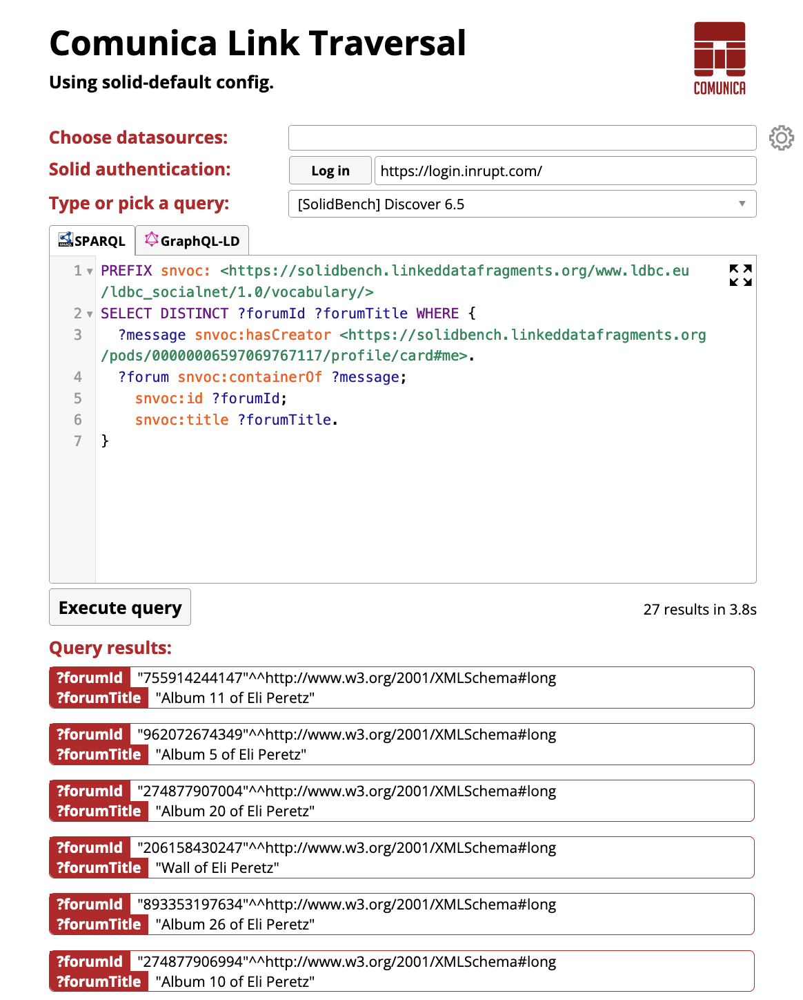
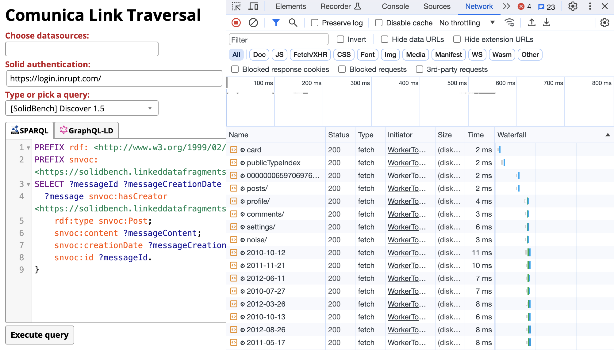
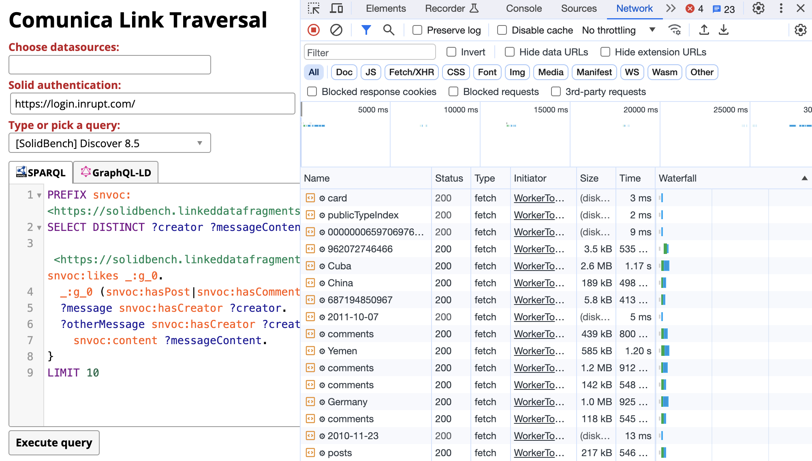

## Demonstration
{:#demonstration}

In this section, we introduce the environment of our demonstration through a Web-based user interface,
after which we discuss our main demonstration scenario.

### User interface

We demonstrate our traversal-based SPARQL query engine for Solid pods through a Web-based user interface.
Since our engine was implemented in TypeScript, it can be transpiled down to JavaScript, and executed client-side within any Web browser.
Concretely, we make use of the [Comunica jQuery widget](https://github.com/comunica/jQuery-Widget.js){:.mandatory}
to generated a static HTML page that contains our traversal-based query engine, as shown in the figure below.
This page is hosted on [https://comunica.github.io/comunica-feature-link-traversal-web-clients/builds/solid-default/](https://comunica.github.io/comunica-feature-link-traversal-web-clients/builds/solid-default/), and will remain available permanently after the conference.

<figure id="figure-ui-screenshot">

<figcaption markdown="block">
Web-based user interface of our traversal-based SPARQL query engine.
</figcaption>
</figure>

<iframe src="https://comunica.github.io/comunica-feature-link-traversal-web-clients/builds/solid-default/#query=PREFIX%20snvoc%3A%20%3Chttps%3A%2F%2Fsolidbench.linkeddatafragments.org%2Fwww.ldbc.eu%2Fldbc_socialnet%2F1.0%2Fvocabulary%2F%3E%0ASELECT%20DISTINCT%20%3FforumId%20%3FforumTitle%20WHERE%20%7B%0A%20%20%3Fmessage%20snvoc%3AhasCreator%20%3Chttps%3A%2F%2Fsolidbench.linkeddatafragments.org%2Fpods%2F00000006597069767117%2Fprofile%2Fcard%23me%3E.%0A%20%20%3Fforum%20snvoc%3AcontainerOf%20%3Fmessage%3B%0A%20%20%20%20snvoc%3Aid%20%3FforumId%3B%0A%20%20%20%20snvoc%3Atitle%20%3FforumTitle.%0A%7D" width="100%" height="800px"></iframe>

Our Web-based user interface allows users to write custom SPARQL queries
and select seed URLs by selecting datasources from the dropdown-list or typing in custom URLs.
If no datasources are selected, the engine will fallback to a query-based seed URL selection approach,
where URLs mentioned in the SPARQL query will be considered as seed URLs.
Next to writing custom SPARQL queries, the user may also select one of the predefined queries from the dropdown-list.
Furthermore, the user can also authenticate with a Solid account by using the "Log in" button.

After inserting or selecting a SPARQL query, the user can click on the "Execute query" button,
after which the query engine will execute the query.
This execution will take place in a separate [Web worker process](https://developer.mozilla.org/en-US/docs/Web/API/Web_Workers_API/Using_web_workers),
as not to halt interactions with the user interface.
Each result that is iteratively produced by the query engine will be shown immediately in the scrollable list of query results at the bottom of the page.

### Scenario

Our publicly available Web-based user interface allows users to execute SPARQL queries across any existing Solid pods.
Since not everyone may own a Solid pod, our primary demonstration scenario involves an environment
in which we have setup a large number of simulated Solid pods.

Concretely, we host 1.531 Solid pods that were generated using the default settings of the [SolidBench](cite:cites solidquery) dataset generator,
which consists of 3.556.159 triples spread over 158.233 RDF files across these pods.
The SolidBench dataset is derived from the [LDBC Social Network Benchmark (SNB)](cite:cites ldbc_snb_interactive),
which provides a social network use case,
in which people can be friends of each other,
create posts, and like and comment on each others posts.
Furthermore, we have pre-configured some of the SPARQL queries that SolidBench provides,
which can then be executed over this simulated environment.

Our demonstration scenario will start by showing the SPARQL query *"Discover 1.5"* from SolidBench,
which will produce all posts that are created by a specific person.
For this, we will enable the Network inspection tool tab within the Chrome browser,
which allows the audience to see the Resource Waterfall of all HTTP requests that were required to execute the query.
This shows how some HTTP requests depend on other requests due to links between them,
while other requests may be done in parallel.
 shows a screenshot of this scenario.

<figure id="figure-ui-resource-waterfall-1-5">

<figcaption markdown="block">
The Resource Waterfall logs when executing Discover 1.5 from SolidBench.
</figcaption>
</figure>

Since *"Discover 1.5"* will primarily target a single Solid pod,
we will also show *"Discover 8.5"*, which targets multiple Solid pods
and will return all posts by authors of posts that a given person likes.
In contrast to the previous query, *"Discover 8.5"* will traverse across multiple Solid pods,
as shown in 
Since this happens in a traversal-based manner,
all of this happens automatically in the background without requiring any user interaction.

<figure id="figure-ui-resource-waterfall-8-5">

<figcaption markdown="block">
The Resource Waterfall logs when executing Discover 8.5 from SolidBench.
</figcaption>
</figure>

Besides these 2 queries in the main demonstration scenario,
we provide a total of 37 default queries that can be selected in the dropdown-list of queries.
