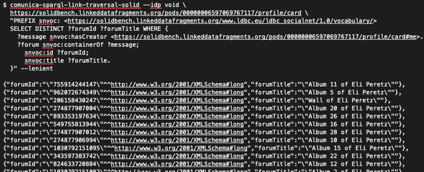

## Implementation
{:#implementation}

Our approach has been implemented using the JavaScript/TypeScript-based [Comunica SPARQL framework](cite:cites comunica).
Following the modular architecture of Comunica,
we have implemented our approach in several small modules,
which allows modules to be enabled or disabled using a plug-and-play configuration system
for the flexible combination of techniques during experimentation.
This implementation has full support for SPARQL 1.1 queries,
which consists of pipelined implementations of all monotonic SPARQL operators.
As such, our system is able to execute SPARQL queries over Solid pods using a traversal-based approach.
Since certain documents within Solid pods may exist behind access control,
our implementation supports authentication.
This allows users to log into the query engine using their Solid account,
after which the query engine will execute query on their behalf across all data the user can access.

Our implementation is available under the MIT license at [https://github.com/comunica/comunica-feature-link-traversal](https://github.com/comunica/comunica-feature-link-traversal),
and via the npm package manager as [`@comunica/query-sparql-link-traversal-solid`](https://www.npmjs.com/package/@comunica/query-sparql-link-traversal-solid).
Our implementation can be used directly within any TypeScript or JavaScript application.
Furthermore, we provide a script using which queries can be executed from the command line,
as shown in .

<figure id="figure-cli">

<figcaption markdown="block">
Executing a SPARQL query from the command line.
</figcaption>
</figure>
